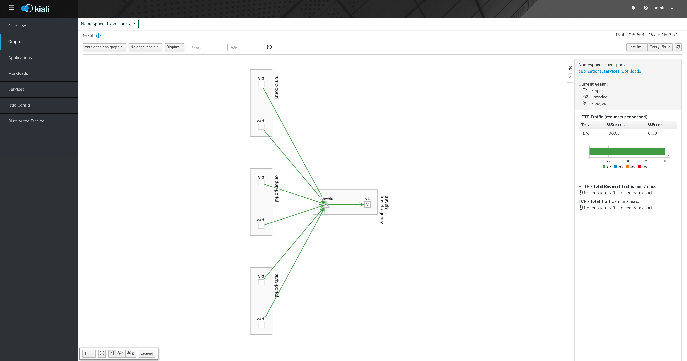

# travel-comparison-demo
A Microservices demo based on Istio Service Mesh tool. 

This goal of this demo is to demostrate [Istio](https:/istio.io/) cappabilities observed and managed by [Kiali](https://kiali.io) tool. 

## Travel Portal

This demo creates two groups of services to simulate a travel portal scenario.

In a first namespace called **travel-portal** there will be deployed a set of services that will represent the portals 
where users access to search and book travels.

One of the characteristics of **travel-portal** is that there will be different portals depending of which city users are 
interested on. In this example, there will be three portals for *Rome*, *Paris* and *London*.

Also, every portal will have two versions, one version to handle regular web traffic and a second version that will 
manage vip users with special offers and discounts.

For our demo, we don't care about the details of the application but the relationships between services as
it is shown in the picture:

   

Portal applications from **travel-portal** namespace will invoke a *travels* service from a **travel-agency** namespace
to get travel quotes for their searches.

## Travel Agency

A second namespace called **travel-agency** will host a set of services created to provide quotes for travels.

A main **travels** service will be the business entry point for the travel agency. 
It receives a city and a user as parameters and it calculates all elements that compose a travel budget: airfares, lodging, car reservation and travel insurances.

There are several services that calculate a separate price and the **travels** service is responsible to aggregate them in a single response.

Additionally, some users like *vip* users can have access to special discounts, managed as well by an external service.

The interaction between services can be shown in the following picture:

  

## travel_agency.go

The travel_agency.go is a tiny program that helps to build the services deployed in the **travel-agency** namespace.

The *travel_agency.yaml* descriptor deploys all the services backed by travel_agency.go program as it shows in the following example: 

```yaml
...
apiVersion: extensions/v1beta1
kind: Deployment
metadata:
  name: travels-v1
spec:
  replicas: 1
  template:
    metadata:
      annotations:
        readiness.status.sidecar.istio.io/applicationPorts: ""
      labels:
        app: travels
        version: v1
    spec:
      containers:
        - name: travels
          image: lucasponce/travel_agency:dev
          imagePullPolicy: IfNotPresent
          ports:
            - containerPort: 8000
          securityContext:
            privileged: false
          env:
            - name: FLIGHTS_SERVICE
              value: "http://flights:8000"
            - name: HOTELS_SERVICE
              value: "http://hotels:8000"
            - name: CARS_SERVICE
              value: "http://cars:8000"
            - name: INSURANCES_SERVICE
              value: "http://insurances:8000"
            - name: CURRENT_SERVICE
              value: "travels"
            - name: CURRENT_VERSION
              value: "v1"
---
apiVersion: v1
kind: Service
metadata:
  name: travels
  labels:
    app: travels
spec:
  ports:
    - name: http
      port: 8000
  selector:
    app: travels
...
```

One of the interesting features, is travel_agency.go allows to introduce conditional delays to emulate different slower 
services under different versions, like the example defined in travel_agency_v2.yaml descriptor:

```yaml
apiVersion: extensions/v1beta1
kind: Deployment
metadata:
  name: flights-v2
spec:
  replicas: 1
  template:
    metadata:
      annotations:
        readiness.status.sidecar.istio.io/applicationPorts: ""
      labels:
        app: flights
        version: v2
    spec:
      containers:
        - name: flights
          image: lucasponce/travel_agency:dev
          imagePullPolicy: IfNotPresent
          ports:
            - containerPort: 8000
          securityContext:
            privileged: false
          env:
            - name: CURRENT_SERVICE
              value: "flights"
            - name: CURRENT_VERSION
              value: "v2"
            - name: DISCOUNTS_SERVICE
              value: "http://discounts:8000"
            - name: CHAOS_MONKEY
              value: "true"
            - name: CHAOS_MONKEY_SLEEP
              value: "50"
```

Review [travel_agency.go](travel_agency/travel_agency.go) code to learn all available options to introduce Chaos in the scenario.
